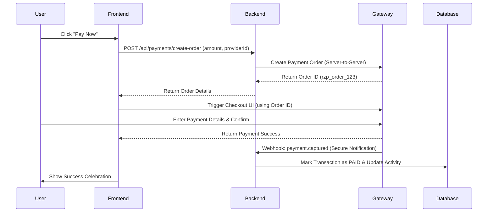

                                       # Payment Integration Plan for E-Advocate Platform

This document outlines the strategy for moving from simulated payments to actual financial transactions using a payment gateway like **Razorpay** or **Stripe**.

## 1. Technical Architecture

The payment flow requires a secure coordination between the Frontend, Backend, and the Payment Gateway API.



## 2. Implementation Steps

### Phase A: Backend Setup
1. **Dependency Injection**: Install gateway SDK (e.g., `npm install razorpay` or `stripe`).
2. **Order API**:
   - Validate the service fee.
   - Calculate platform fee (19%).
   - Create an `Order` entry in MongoDB with status `PENDING`.
3. **Webhook Controller**:
   - Implement an endpoint to receive signed notifications from the gateway.
   - Verify the signature to prevent fraudulent "success" calls.

### Phase B: Frontend Enhancement
1. **SDK Injection**: Add the gateway's `<script>` tag to `index.html`.
2. **Payment Handler**:
   - Replace the `alert()` in `DashboardLegalDocs.tsx` with a call to the Backend Order API.
   - Initialize the `Checkout` instance provided by the gateway.
3. **Success/Failure Routing**: Handle internal redirects to a "Payment Successful" screen.

## 3. Data Schema Update

Update the `Activity` or a new `Transaction` collection:
```json
{
  "userId": "User-123",
  "providerId": "Adv-456",
  "amount": 2500,
  "platformFee": 475,
  "gatewayOrderId": "order_K8d2sJS92",
  "status": "COMPLETED",
  "timestamp": "2023-10-27T10:00:00Z"
}
```

## 4. Next Actions
- [ ] Select a Payment Gateway (Razorpay is recommended for India).
- [ ] Provide API Keys (Key ID & Secret) in `.env` file.
- [ ] Implement the `POST /api/payments/create-order` endpoint.
